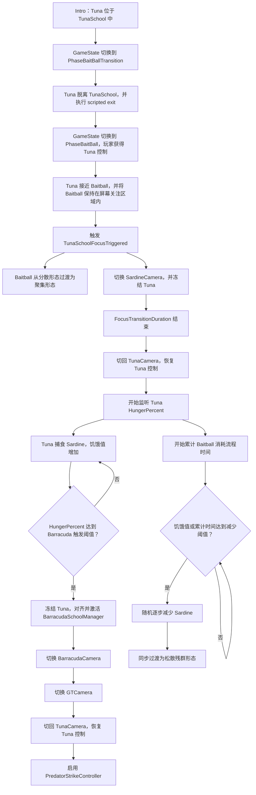

# TestBoids 当前游戏流程

本文档记录当前 `TunaSchool` 游戏流程，以及控制各阶段的主要脚本、事件、方法和 Inspector 参数。

## 流程总览



## 第一部分：Intro 与 Tuna 脱离鱼群

### GameState

游戏状态定义在：

- `Assets/Scripts/Gameplay/GameState.cs`

当前状态：

| 状态 | 含义 |
| --- | --- |
| `Intro` | 初始阶段，Tuna 仍属于 TunaSchool |
| `PhaseBaitBallTransition` | Tuna 正在脱离 TunaSchool |
| `PhaseBaitBall` | 玩家正式控制 Tuna，进入 Baitball 阶段 |

### 状态切换

控制脚本：

- `Assets/Scripts/Gameplay/GameStateManager.cs`

关键方法：

| 方法 | 作用 |
| --- | --- |
| `Update()` | 当前支持在 `Intro` 阶段按测试按键切换到 `PhaseBaitBallTransition` |
| `SetState(GameState nextState)` | 更新当前状态并广播 `StateChanged` |
| `WasPhaseBaitBallTestKeyPressed()` | 检查阶段切换测试按键 |

关键事件：

```csharp
StateChanged(GameState previousState, GameState nextState)
```

### Tuna 脱离 TunaSchool

控制脚本：

- `Assets/Scripts/Gameplay/PlayerFishSchoolBridge.cs`

收到 `PhaseBaitBallTransition` 后：

1. `OnStateChanged()` 调用 `BeginScriptedExit()`。
2. `ReleasePlayerFish()` 将玩家鱼从 `FishSchoolManager` 中释放。
3. `EnableTunaMotor()` 启用 Tuna 移动组件。
4. `TunaMotor.BeginScriptedSwim()` 开始预设方向游动。
5. `RunScriptedExit()` 等待 `scriptedExitDuration`。
6. `AdvanceToPhaseBaitBall()` 将状态切换为 `PhaseBaitBall`。
7. `CompletePlayerControl()` 调用 `TunaMotor.EndScriptedSwim()`，恢复手动控制。

### 场景对象和基础相机切换

控制脚本：

- `Assets/Scripts/Gameplay/FishFlockSwitcherToGameState.cs`
- `Assets/Scripts/Gameplay/CameraPrioritySwitcher.cs`

`FishFlockSwitcherToGameState.ApplyState()`：

- `PhaseBaitBallTransition`：激活 `BaitBallManager`。
- `PhaseBaitBall`：保持 `BaitBallManager` 激活，并关闭 `TunaSchoolManager`。

`CameraPrioritySwitcher.ApplyState()`：

- `Intro`：激活 `IntroCamera`。
- `PhaseBaitBallTransition` 和 `PhaseBaitBall`：激活 `TunaCamera`。

## 第二部分：Tuna 接近 Baitball

### 接近触发条件

控制脚本：

- `Assets/Scripts/Gameplay/TunaSchoolFocusDetector.cs`

`Update()` 每帧检查：

1. Tuna 与 Baitball 的距离不大于 `focusDistance`。
2. `ScreenEdgeGuideIndicator.IsTargetInsideScreenBounds` 为 `true`。
3. 若 `triggerOnce` 开启，则此前尚未触发。

满足条件后，`RaiseFocusEvent()` 通过 `GameplayEventBus` 广播：

```csharp
TunaSchoolFocusTriggered(TunaSchoolFocusEvent focusEvent)
```

`TunaSchoolFocusEvent` 包含：

- `Tuna`：Tuna Transform。
- `FishSchool`：Baitball Transform。
- `Distance`：触发时 Tuna 与 Baitball 的距离。

### GameplayEventBus

控制脚本：

- `Assets/Scripts/Gameplay/GameplayEventBus.cs`

主要事件：

| 事件 | 触发时机 |
| --- | --- |
| `TunaSchoolFocusTriggered` | Tuna 满足接近和屏幕关注条件时 |
| `SardineSchoolGathered` | Sardine 镜头阶段结束、Tuna 恢复控制时 |

流程时间参数：

| Inspector 参数 | 用途 |
| --- | --- |
| `focusTransitionDuration` | Baitball 聚集时长，同时也是 SardineCamera 停留时长 |
| `barracudaCameraDuration` | BarracudaCamera 停留时长 |
| `gtCameraDuration` | GTCamera 停留时长 |

## 第三部分：Baitball 聚集与 SardineCamera

### Baitball 聚集

控制脚本：

- `Assets/Scripts/Boids/BaitBallFormationController.cs`

调用链：

1. `SubscribeToEventBus()` 订阅 `TunaSchoolFocusTriggered`。
2. `OnTunaSchoolFocusTriggered()` 调用 `BeginFocusTransition()`。
3. `Update()` 根据过渡时间和 `focusTransitionCurve` 插值鱼群形态。
4. `CompleteFocusTransition()` 应用最终聚集形态，并启用 `BaitBallBehaviorModulator`。

聚集时长由 `GetFocusTransitionDuration()` 从 `GameplayEventBus.FocusTransitionDuration` 读取。

### Sardine 镜头阶段

总流程控制脚本：

- `Assets/Scripts/Gameplay/TunaSchoolFocusSequenceController.cs`

`OnTunaSchoolFocusTriggered()`：

1. 解析 `TunaFreezeController` 和 `TunaMotor`。
2. 启动 `RunSardineSequence()`。

`RunSardineSequence()`：

1. `SetActiveCamera(tunaSchoolFocusCamera)` 切换到 SardineCamera。
2. 可选等待 `freezeDelayAfterFocusCamera`。
3. `FreezeTuna()` 冻结 Tuna。
4. `PlayNarration()` 播放旁白。
5. 等待 `GameplayEventBus.FocusTransitionDuration`。
6. `SetActiveCamera(thirdPersonAimCamera)` 切回 TunaCamera。
7. `UnfreezeTuna()` 恢复 Tuna 控制。
8. `RaiseSardineSchoolGathered()` 广播 Sardine 已聚集事件。
9. `BeginMonitoringHunger()` 开始监听饥饿值。

### Tuna 冻结与恢复

控制脚本：

- `Assets/Scripts/Tuna/TunaFreezeController.cs`

关键方法：

| 方法 | 作用 |
| --- | --- |
| `Freeze()` | 保存速度与 Rigidbody 约束，速度归零，冻结 Rigidbody，并可关闭 `TunaMotor` |
| `Unfreeze()` | 恢复 Rigidbody 约束、速度和 `TunaMotor` 启用状态 |

## 第四部分：Tuna 捕食与饥饿值

### 捕食 Sardine

控制脚本：

- `Assets/Scripts/Tuna/TunaPredationSensor.cs`

`FixedUpdate()` 会在满足以下条件时尝试捕食：

- 不在捕食冷却期。
- Tuna 和 Baitball 引用有效。
- Tuna 未达到最大饥饿值，或 `stopEatingWhenFull` 已关闭。
- Tuna 速度达到 `minEatSpeed`。
- Baitball 中有鱼位于嘴部捕食半径和角度内。

捕食成功后：

1. `InstancedFishSchoolManager.TryConsumeFish()` 移除一条 Sardine。
2. `TunaMotor.AddHunger(hungerPerFish)` 增加饥饿值。
3. 播放粒子和音效反馈。

### 饥饿值

数据与事件位于：

- `Assets/Scripts/Tuna/TunaMotor.cs`

主要成员：

| 成员 | 作用 |
| --- | --- |
| `CurrentHunger` | 当前饥饿值 |
| `MaxHunger` | 最大饥饿值 |
| `HungerPercent` | 当前饥饿百分比，范围为 `0-1` |
| `AddHunger(float amount)` | 增加饥饿值 |
| `HungerChanged(float currentHunger, float maxHunger)` | 饥饿值实际变化时广播 |

当前数值语义是“捕食进度”：Tuna 吃到 Sardine 后数值增加。

### Barracuda 触发阈值

配置位置：

- `TunaSchoolFocusSequenceController`
- Inspector 分组：`Hunger Trigger`
- 参数：`barracudaTriggerHungerPercent`

默认值为 `0.8`，表示 Tuna 的 `HungerPercent` 达到 80% 时触发 Barracuda 演出。

监听调用链：

1. `BeginMonitoringHunger()` 订阅 `TunaMotor.HungerChanged`。
2. `OnTunaHungerChanged()` 调用 `TryStartBarracudaSequence()`。
3. 达到阈值后停止监听，并启动 `RunBarracudaSequence()`。
4. 若开始监听时 Tuna 已达到阈值，会立即触发第二阶段。

## 第五部分：Barracuda 演出与攻击

### Barracuda 镜头阶段

控制脚本：

- `Assets/Scripts/Gameplay/TunaSchoolFocusSequenceController.cs`

`RunBarracudaSequence()`：

1. `FreezeTuna()` 再次冻结 Tuna。
2. `PrepareBarracudaSchool()` 对齐并激活 BarracudaSchoolManager。
3. 切换到 BarracudaCamera。
4. 等待 `GameplayEventBus.BarracudaCameraDuration`。
5. 切换到 GTCamera。
6. 等待 `GameplayEventBus.GTCameraDuration`。
7. 切回 TunaCamera。
8. `UnfreezeTuna()` 恢复 Tuna 控制。
9. `EnableBarracudaPredatorStrike()` 启用 Barracuda 攻击。

`PrepareBarracudaSchool()` 会：

1. 禁用 `PredatorStrikeController`，避免镜头演出期间提前攻击。
2. 将 BarracudaSchoolManager 的位置、旋转和缩放同步到 Baitball。
3. 激活 BarracudaSchoolManager。

### Barracuda 攻击

控制脚本：

- `Assets/Scripts/Boids/PredatorStrikeController.cs`

启用后，`Update()` 周期性调用 `TryStartStrikePulse()`：

1. 从 Barracuda 鱼群中筛选满足距离、冷却和并发数量条件的个体。
2. 计算穿过 Baitball 的攻击路径。
3. 临时将个体交给 Rigidbody 外部控制。
4. 攻击持续时间结束后，将个体交还 `FishSchoolManager`。

`baitBallTarget` 未手动指定时，`ResolveReferences()` 会查找场景中的 `BaitBallFormationController`，并使用其 Transform。

## 第六部分：Baitball 最终减少与松散残群

控制脚本：

- `Assets/Scripts/Gameplay/BaitBallDepletionController.cs`

流程从 `SardineSchoolGathered` 广播时开始，与 Tuna 饥饿值监听使用同一起点。控制器只执行一次最终减少：

1. `HungerThreshold` 或 `ElapsedTimeThreshold` 满足任意一个条件后，开始减少。
2. 在 `DepletionDuration` 内随机逐步移除 Sardine，直到达到 `TargetFishCount`。
3. Tuna 捕食可同时减少数量；若数量提前达到目标，控制器停止额外移除。
4. Tuna 冻结和 Barracuda 镜头演出不会停止计时或正在执行的减少过程。
5. 减少 Sardine 的同时，将鱼群平滑过渡为松散残群形态；完成后停止监控。

松散残群过渡只修改以下形态参数：

- `Radius`
- `CenteringWeight`
- `ToroidalFlowWeight`
- `SeparationRadius`
- `AlignWeight`
- `CohesionWeight`

其他 `FormationSettings` 保持减少触发前的值。默认会在减少开始时禁用 `BaitBallBehaviorModulator`，避免它继续覆盖松散残群的目标权重。

随机移除接口位于：

- `Assets/Scripts/Boids/InstancedFishSchoolManager.cs`
- `RemoveRandomFish(int count)`

该接口随机选择指定数量的鱼并一次性调整底层数组，保留其余实例的位置与运动状态，不会像 `SetCount()` 一样重新生成整个鱼群。阶段控制器每帧根据当前进度调用一次，使大量 Sardine 仍能在阶段持续时间内逐步消失，同时避免逐条重建数组。

## TunaSchoolFocusSequenceController 关键方法

| 方法 | 职责 |
| --- | --- |
| `OnTunaSchoolFocusTriggered()` | 接收接近事件，启动 Sardine 阶段 |
| `RunSardineSequence()` | SardineCamera、首次冻结、聚集等待、恢复控制 |
| `BeginMonitoringHunger()` | 第一阶段结束后订阅饥饿值变化 |
| `TryStartBarracudaSequence()` | 检查阈值并保证 Barracuda 阶段只触发一次 |
| `RunBarracudaSequence()` | 第二次冻结、Barracuda/GT 镜头、恢复和攻击启用 |
| `PrepareBarracudaSchool()` | 禁用攻击、同步 Baitball Transform、激活 BarracudaSchoolManager |
| `SetActiveCamera()` | 通过 Cinemachine priority 切换流程相机 |
| `StopRunningSequence()` | 控制器停用或流程中断时恢复 Tuna 和 TunaCamera |
| `StopMonitoringHunger()` | 取消 `TunaMotor.HungerChanged` 订阅 |

## 关键 Inspector 配置

### GameplayEventBus

- `Focus Transition Duration`
- `Barracuda Camera Duration`
- `GT Camera Duration`

### TunaSchoolFocusDetector

- `Focus Distance`
- `Trigger Once`
- `Screen Guide`

### TunaSchoolFocusSequenceController

- `Tuna Freeze Controller`
- `Tuna Motor`
- `Third Person Aim Camera`
- `Tuna School Focus Camera`
- `Barracuda Camera`
- `GT Camera`
- `Barracuda School`
- `Barracuda Predator Strike Controller`
- `Freeze Delay After Focus Camera`
- `Barracuda Trigger Hunger Percent`
- `Active Priority`
- `Inactive Priority`

### TunaPredationSensor

- `Eat Radius`
- `Eat Angle Degrees`
- `Min Eat Speed`
- `Eat Cooldown`
- `Hunger Per Fish`
- `Stop Eating When Full`

### PredatorStrikeController

- 攻击距离范围和最大并发攻击数。
- 初始延迟、攻击间隔、个体冷却时间。
- 攻击速度、Baitball 半径、穿出距离和横向瞄准范围。

### BaitBallDepletionController

- `Depletion`：配置饥饿值阈值、累计时间阈值、目标剩余数量和减少持续时间。
- `Transition To Loose Formation`
- `Disable Behavior Modulator On Depletion`
- `Loose Formation`：配置松散残群的六个精选形态参数。
- `Formation Transition Curve`
- `Use Unscaled Time`

## 自动查找使用的场景对象名

`TunaSchoolFocusSequenceController` 默认按以下名称自动查找：

- `BarracudaSchoolManager`
- `BarracudaCamera`
- `GTCamera`

若场景对象改名，应在 Inspector 中手动绑定引用，或同步修改对应的自动查找名称。

## 中断与清理行为

当 `TunaSchoolFocusSequenceController` 被禁用时：

1. 取消 `GameplayEventBus.TunaSchoolFocusTriggered` 订阅。
2. 取消 `TunaMotor.HungerChanged` 订阅。
3. 停止正在运行的流程协程。
4. 恢复 Tuna 控制。
5. 切回 TunaCamera。
6. 根据配置停止旁白。
